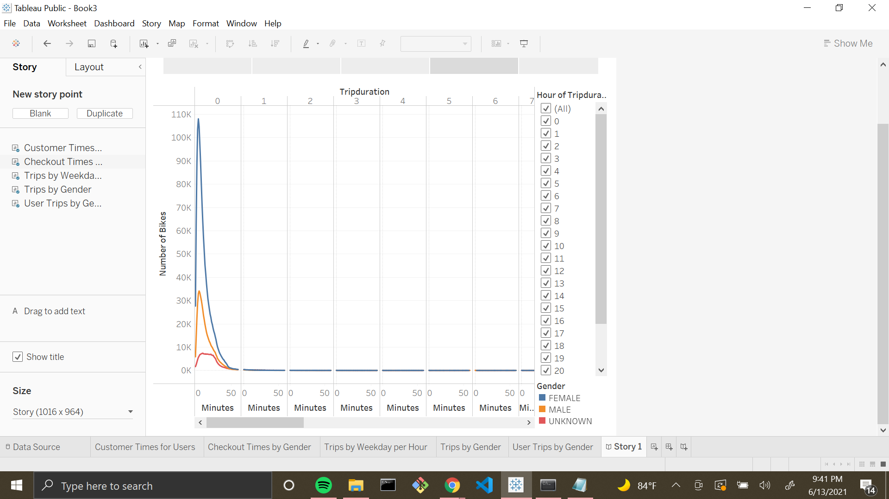

# bikesharing

[link to dashboard](https://public.tableau.com/shared/QB4SGZ2KS?:display_count=n&:origin=viz_share_link)

## Overview of Statistical Analysis
The purpose of this analysis is to provide metrics that display the importance of investing in a bike-sharing program in Des Moines.

## Results
### Trips by Weekday per Hour

During the weekdays, 8AM and 5-6PM experience the most trips per hour. On weekends, 11AM-5PM experience the most trips per hour.

### Trips by Gender

All genders display the same pattern for hours in the day which have the most trips. However, in different quantities. Females seem to take up a large portion of the 
customers.

### User Trips by Gender

Many of the subscribers come from the female user population. The male population also has more subscribed users rather than
customers.

### Checkout Times by Gender

Females rent a significantly higher number of bikes than other genders. 

### Customer Times for Users

The number of bikes is at it's highest aroung 6 minutes into the first trip.

### Average Trip Duration

Individuals born in 1891 appear to have the highest average trip duration, with those born in 1969 right after.

### Bike Utilization

Most bikes experienced trip durations in the hundred thousands. However,a few can be seen to be over 2 million.

## Summary
Based on the visualizations above, many of the customer pool comes from the female population. They are not only more likely to not only rent but also subscribe at a higher rate. It would be interesting to add one more filter to the User Trips by Gender visualization. This would allow us to see the age groups of each gender that are more likely to renting a bike. I would also like to display both Starting Station and Start Time for a count of the number of bikes being used. This would help determine exactly when and where the most bikes are being used.
